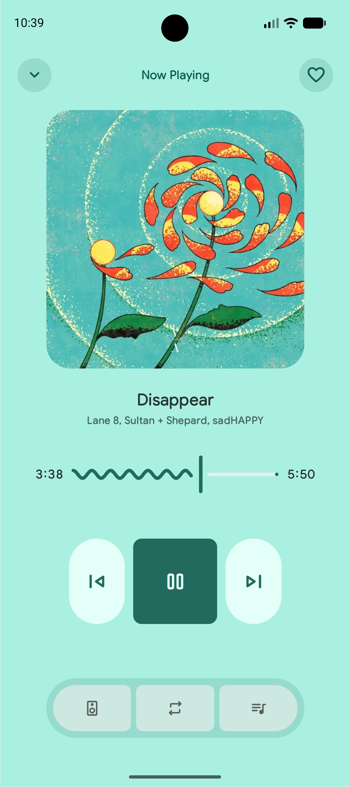
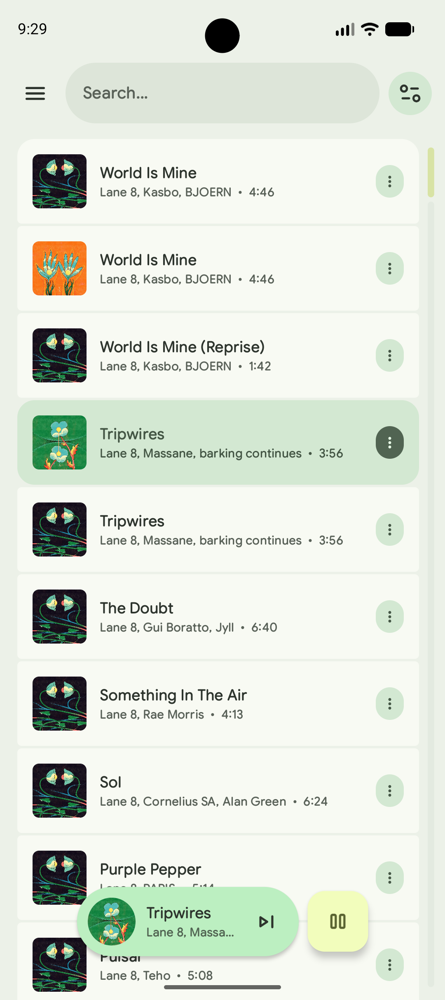
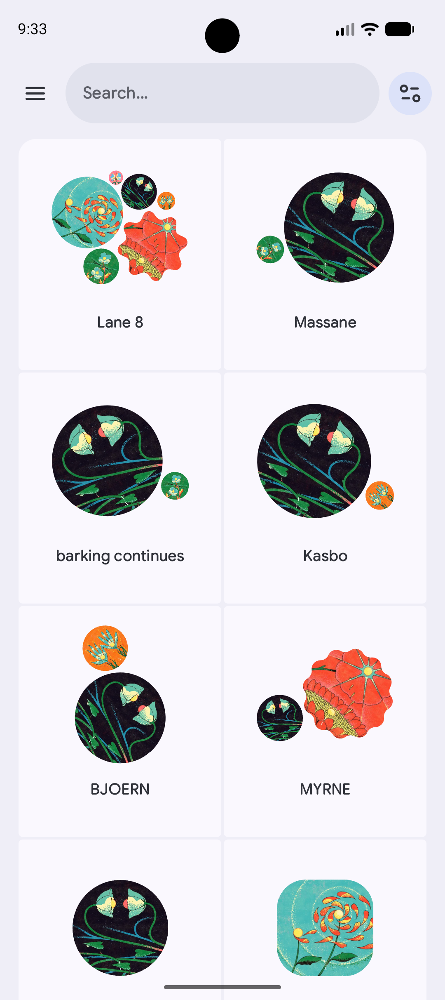
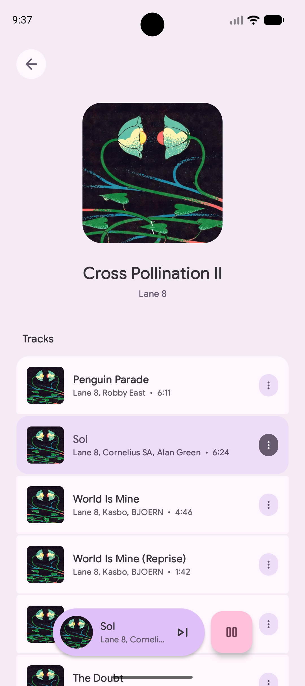
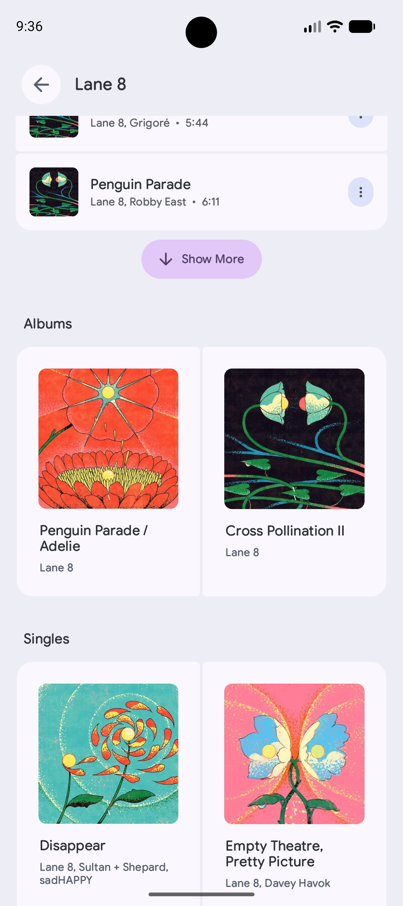
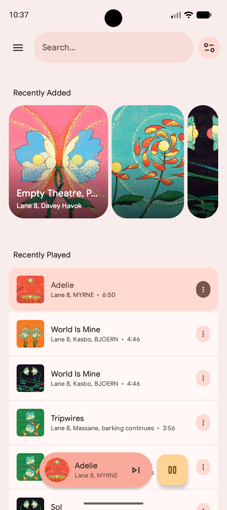

# 
Citole

Lightweight Material 3 Expressive Offline Audio Player 

&nbsp;

### Features (currently under construction)
- play any on-device audio file
- offline playback
- album & artists
- queue management + swipe gestures
- custom shuffle engine (still very beta)

### Screenshots:

  
  
  
  
  
  
  

### Built with:
- Jetpack Compose
- Material 3 Expressive
- Media 3
- Room
- Hilt
- DataStore
- Coil